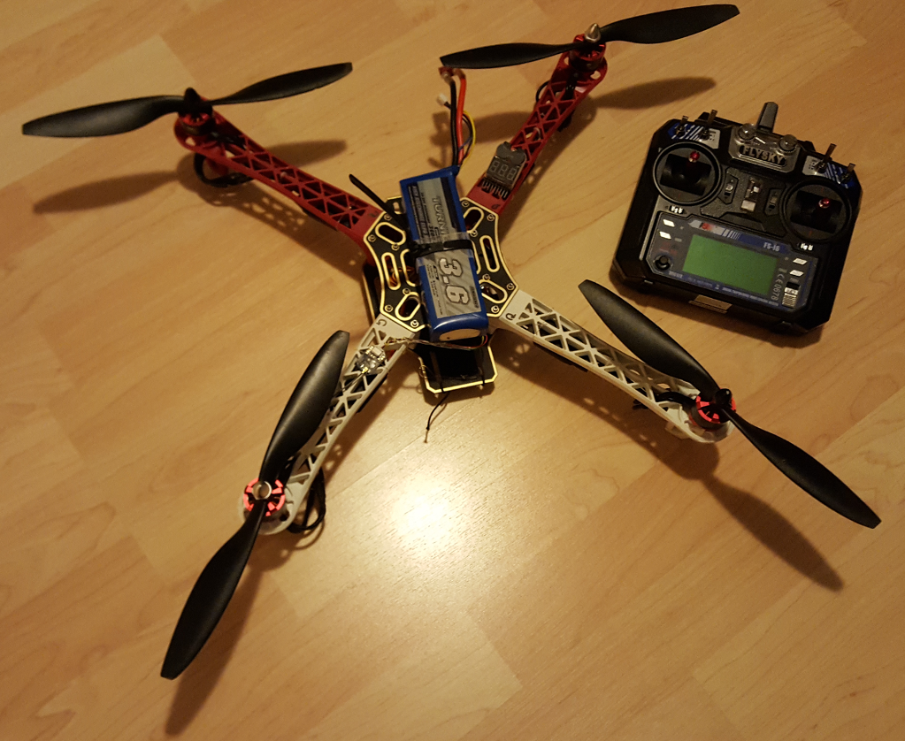

= drone-quadcopter

Drone Quadcopter mounting, customized with additional modules and 3d printed parts.

This repository includes notes gathered along multiple setups, starting from custom code, to specific controller boards.

== Drones

F450 was first build.

It is massive, working but way too big and heavy to allow flying anywhere.

== Stories

* link:stories/01-arduino-testing-esc[Arduino ESC tests]

* link:stories/02-ctrl-multiwii[Controller - MultiWii setup]

* link:stories/03-ctrl-omnibus-f4-pro-v2[Controller - Omnibus F4 pro v2]

* link:stories/04-ctrl-matek-f405-ctr[Controller - Matek F405 CTR]

// * link:stories/05-cam-runcam-split[Camera - Runcam Split]

// * link:stories/06-frame-3d-printing[Frame - 3d printed add-on]

== BOM

Each story includes few items to purchase which are based on size of the board.

Below are items independant of the boards.

.Materials
[width="80%",options="header"]
|=========================================================
|Type | Price | Link | Comments

|Power | ~ 20 to 60 € | 

* link:https://hobbyking.com/fr_fr/zippy-compact-4000mah-3s-25c-lipo-pack.html[Batteries 2 x ~ 4000mAh (30€)]

* Charger iMax B6 Mini Pro (30€)

 | Power pack and charger is unavoidable!

 |Radio | ~ 45€ | 

link:https://www.banggood.com/fr/FlySky-FS-i6-2_4G-6CH-AFHDS-RC-Transmitter-With-FS-iA6B-Receiver-p-983537.html?rmmds=search[FlySky FS-i6]

link:https://www.banggood.com/fr/Flysky-FS-A8S-2_4G-8CH-Mini-Receiver-with-PPM-i-BUS-SBUS-Output-p-1092861.html[FS-A8S]

 | Radio command + receiver

|Misc | ~5€ | 

* link:https://hobbyking.com/fr_fr/hobbykingtm-hku5-5v-5a-ubec.html[UBEC 5v 5A]

* Not needed - link:https://hobbyking.com/fr_fr/matek-micro-bec-5v-12v-adj.html[BEC 5v/12v]

 | Few board must have

|FPV | ~70€ | 

 | FPV system

|=========================================================

== References

* link:https://www.wearefpv.fr/betaflight-3-2-reglages-pid-20170918/[Betaflight PID tuning]

* link:https://blog.dronetrest.com/setting-up-flight-modes-in-cleanflight-betaflight/[Bateflight setting up]

* link:http://bestdronesforme.com/best-drone-flight-controllers-quadcopters-board/[Guides for drones]

