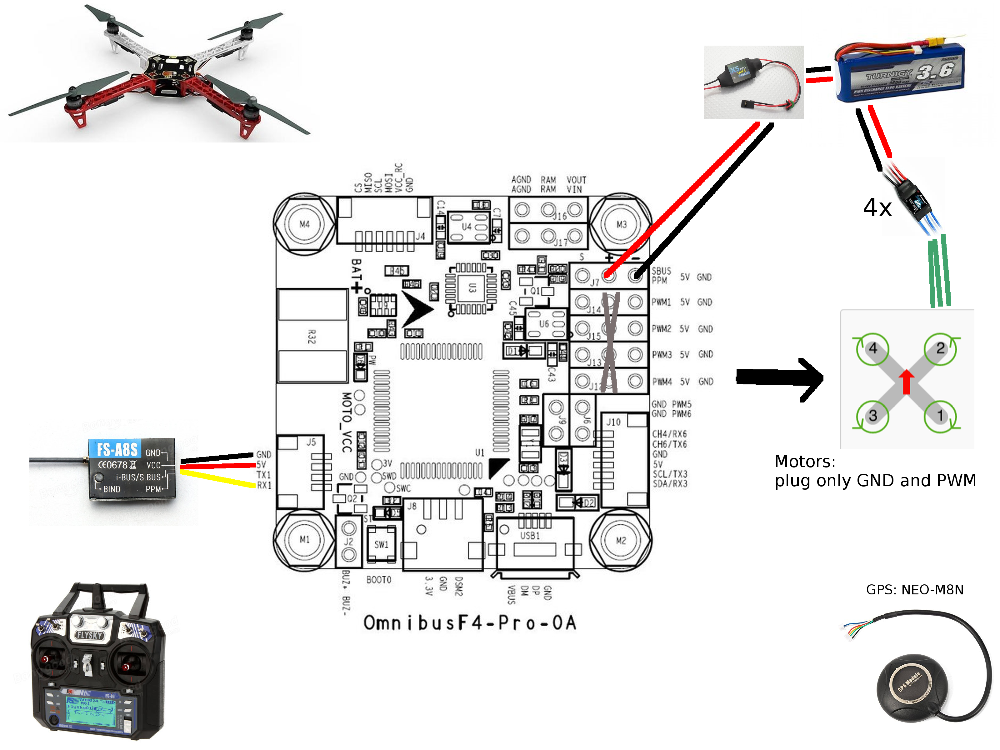
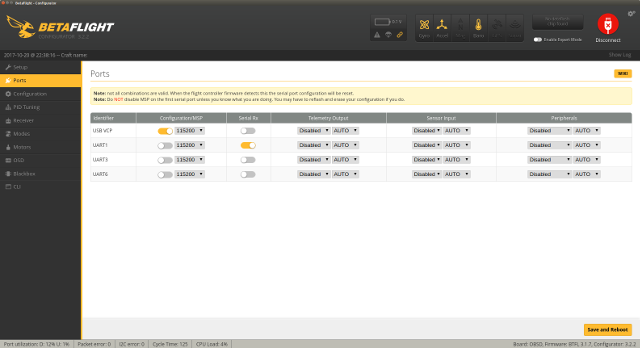
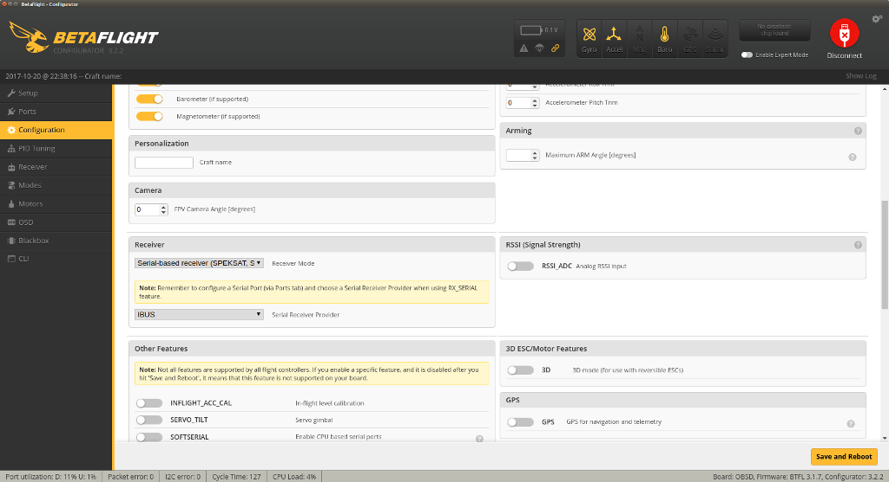
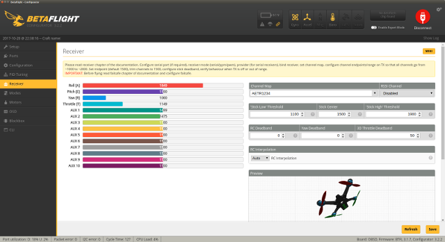

= Omnibus F4 pro v2

Here is a little setup for an F450 frame

image:res/drone-f450.png[F450 frame]

== BOM

* Controller kit: (ebay ~ 50€)
  ** Omnibus F4 v2 pro (using gyro + pressure sensor)
  ** Wires (micro JST)
  ** GPS
  ** Bluetooth

* Frame kit: (ebay ~ 50€)
  ** F450 flavored
  ** Propelers 1045
  ** 4x ESC: Mystery 30A
  ** 4x Motor: B2212-920KV. 

== Notes

Here are few notes on using the board.



== Setup Configurator

Using the board under linux is described below:

* link:https://github.com/betaflight/betaflight/wiki/Installing-Betaflight[Follow linux specific UDEV notes]

```bash
$ (echo '# DFU (Internal bootloader for STM32 MCUs)';  echo 'ACTION=="add", SUBSYSTEM=="usb", ATTRS{idVendor}=="0483", ATTRS{idProduct}=="df11", MODE="0664", GROUP="plugdev"') | sudo tee /etc/udev/rules.d/45-stdfu-permissions.rules > /dev/null
$ udevadm monitor --environment --udev | grep ID_MODEL_ID
ID_MODEL_ID=5740
ID_MODEL_ID=5740
$ sudo vi /etc/udev/rules.d/45-stdfu-permissions.rules
$ sudo udevadm control --reload-rules && udevadm trigger
$ udevadm test $(udevadm info -q path -n /dev/ttyACM0)
$ dmesg | grep tty
$ sudo usermod -a -G plugdev clement
```

* Install Chrome betaflight app

* Run the app and connect to /dev/ttyACM0

* You should see the virtual drone move on XYZ axis

link:drone-betaflight.png[Drone in betaflight]

== Hook and setup Radio

Inspired from link:https://www.youtube.com/watch?v=pNEyERJ1w_8[Youtube video - hooking up receiver](

Translated to usage of "FS-A8S" receiver, this brings to:

* Hook UART 1 to FS-A8S with respecting Ground, Vcc and i-Bus to RX UART. This is shown in image on top of this page.

* Connect board+receiver to Betaflight

* Enable Rx on UART 1



* Set Receiver to be i-Bus



* Test receiver




== References

* link:https://www.youtube.com/watch?v=nQCQXuqQSd8[GPS info ?]

* link:https://nathan.vertile.com/blog/2016/07/07/omnibus-typhoon-miniquad[Info]