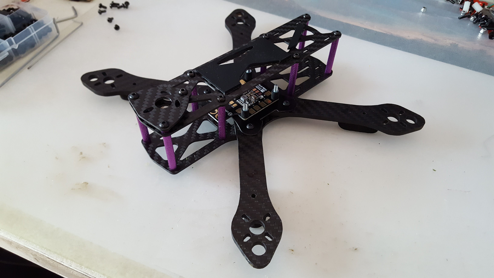
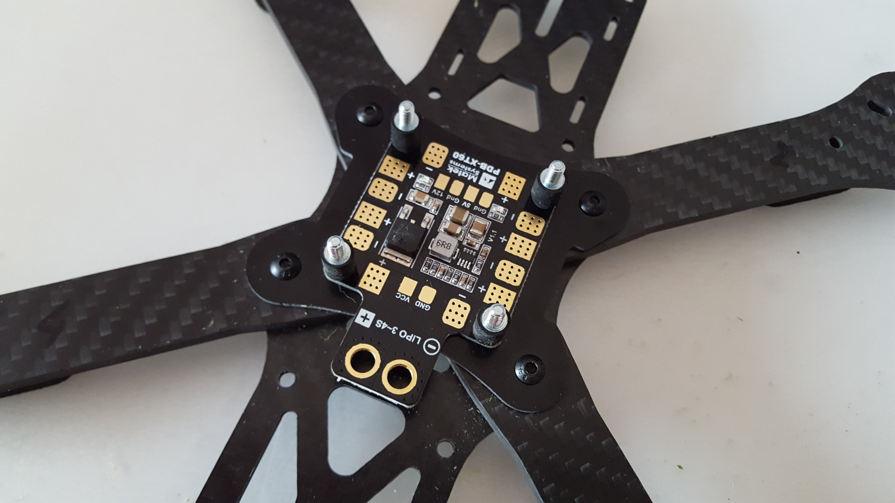
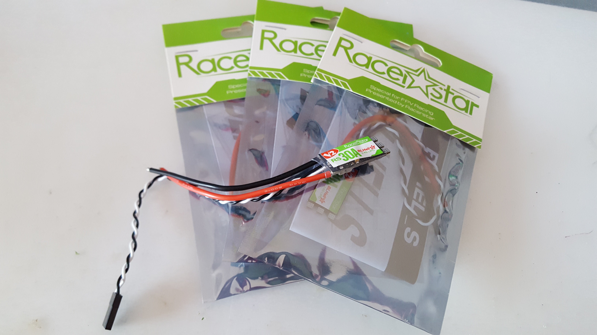
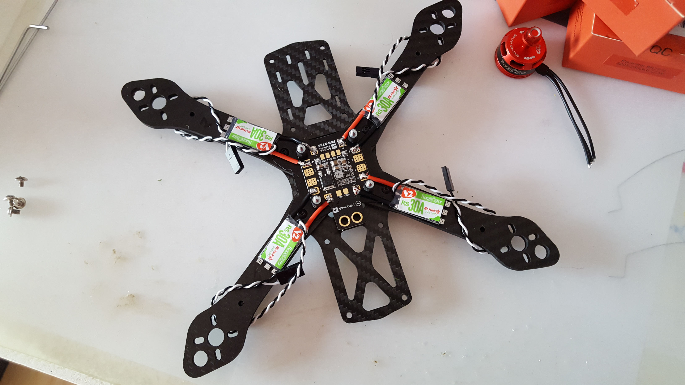
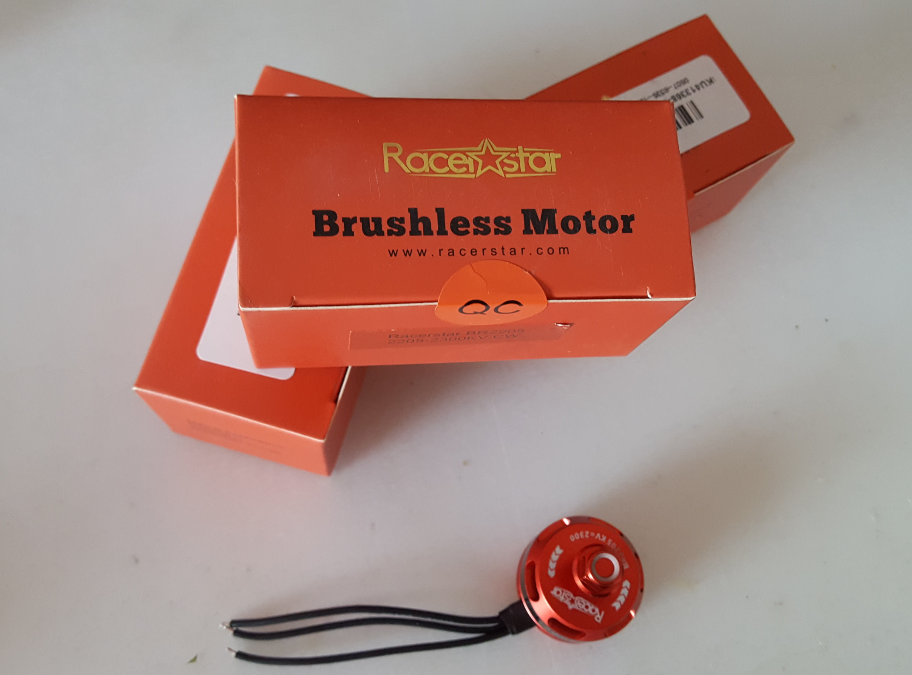
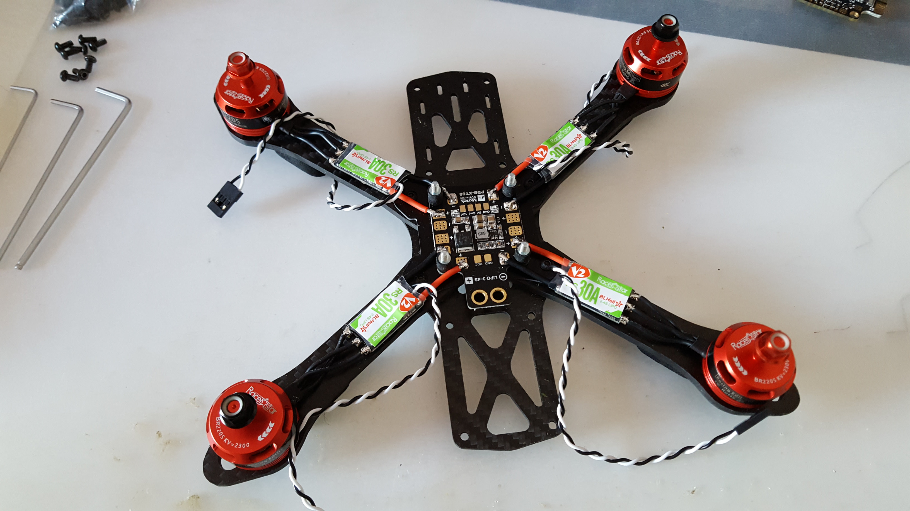
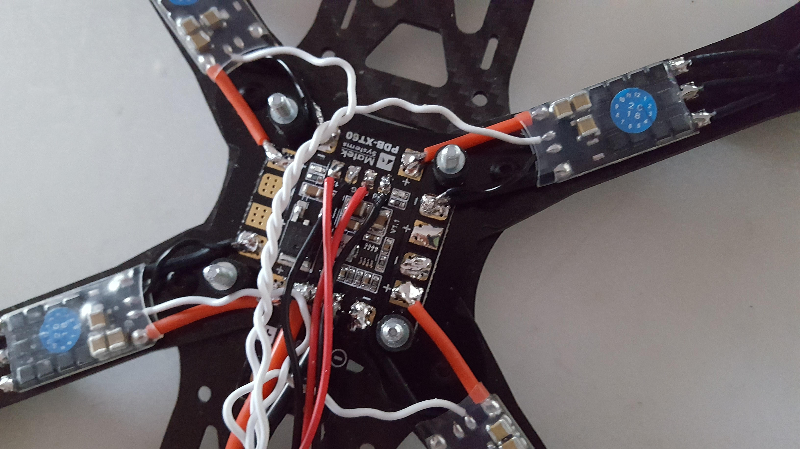
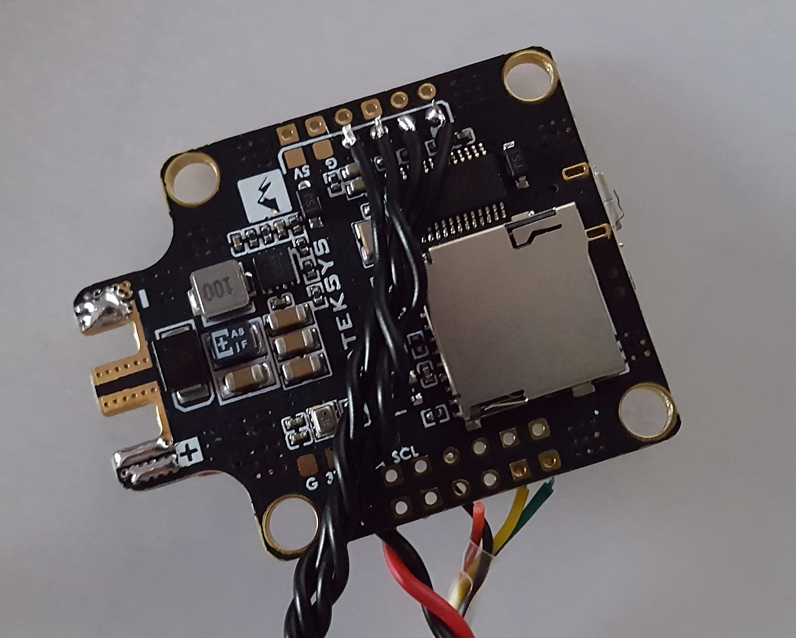
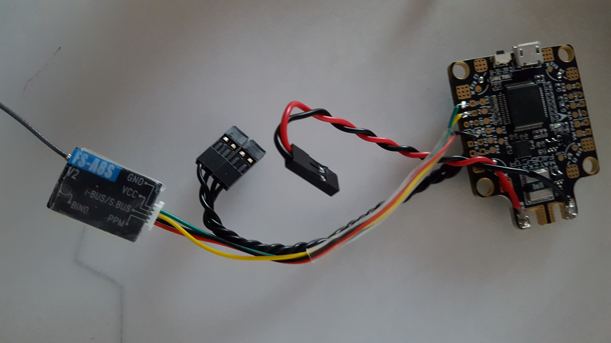

= Martian II build

== BOM

Using Matek F405 CTR

== Wiring

* link:http://www.mateksys.com/?portfolio=f405-ctr#tab-id-3[Matek f405 ctr wiring]

== Building

Here are photos in progress of building:

// 

