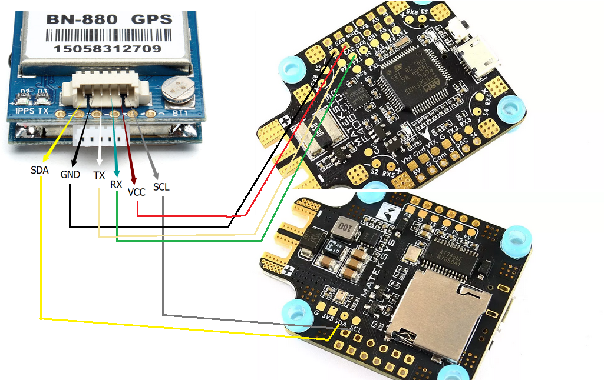

= GPS & Betaflight

Here are references to wiring a GPS to Matek f405 CTR and configuring in Betaflight.

== Wiring

BN-880 wiring





== Configuring Betaflight

* GPS BN-880 - enable Galileo

```bash
set gps_ublox_use_galileo = on
```


* Magnetometer (Compass) CLI settings:

```bash
# set align_mag = CW270FLIP
align_mag set to CW270FLIP
# set mag_hardware = auto
mag_hardware set to AUTO
```

NOTE: Compass can be verified when plug to PC by rotating the GPS should move slightly the Quad display like moving controller itself.

== 3d prints

TODO: Check link:https://www.thingiverse.com/search?q=bn-880[3d parts] and design Openscad

== References

* link:https://oscarliang.com/gps-mini-quad/[OscarLiang GPS tutorial]

* link:http://www.makeandfly.com/2018/08/09/gps-betaflight/[Other Betaflight tutorial]

* link:https://github.com/iNavFlight/inav/wiki/GPS--and-Compass-setup[Yet another tutorial]

* link:https://github.com/betaflight/betaflight/wiki/GPS-rescue-mode[GPS Rescue Mode]
